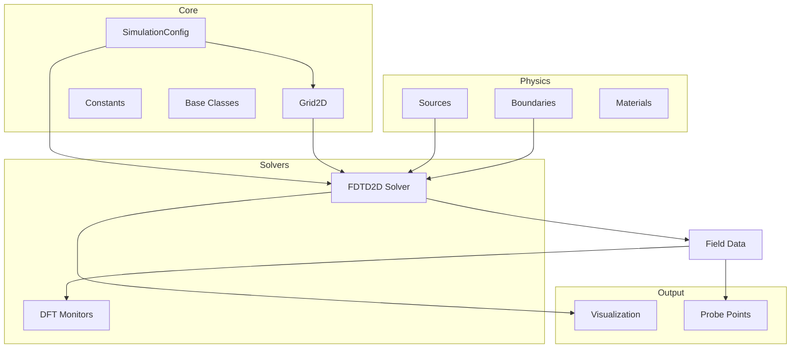

# NeuroWave Architecture Overview

> Software architecture documentation for the NeuroWave electromagnetic simulation framework.

---

## Module Interaction Diagram



## Data Flow

```
User Script
    │
    ├── Create GridConfig (nx, ny, dx, dy)
    ├── Create SimulationConfig (grid, mode, courant, steps)
    ├── Create Sources (Gaussian, CW, etc.)
    ├── Create Boundaries (CPML, Mur, PEC)
    │
    ▼
FDTD2D Solver
    │
    ├── Initialize Grid2D (allocate field arrays)
    ├── Precompute update coefficients (Ca, Cb, Da, Db)
    │
    ▼ For each timestep:
    │
    ├── 1. Update H-fields (vectorized NumPy)
    ├── 2. Apply H-field boundary corrections
    ├── 3. Update E-fields (vectorized NumPy)
    ├── 4. Inject sources (soft, additive)
    ├── 5. Apply E-field boundary corrections
    ├── 6. Record snapshots / probe data
    │
    ▼
Output
    ├── Field snapshots (list of 2D arrays)
    ├── Probe time-series (dict of lists)
    └── Visualization (matplotlib figures)
```

## Module Responsibilities

| Module | Responsibility | Key Classes |
|--------|---------------|-------------|
| `core.constants` | Physical constants, CFL calculators | `C_0`, `EPS_0`, `cfl_timestep_2d` |
| `core.config` | Simulation parameters | `GridConfig`, `SimulationConfig` |
| `core.grid` | Yee grid, field arrays, materials | `Grid2D` |
| `core.base` | Abstract interfaces | `BaseSource`, `BaseBoundary`, `BaseSolver` |
| `sources.waveforms` | Temporal excitation sources | `GaussianSource`, `SinusoidalSource` |
| `boundaries.absorbing` | Absorbing/reflecting BCs | `PEC`, `MurABC`, `CPML` |
| `solvers.fdtd_2d` | FDTD time-stepping engine | `FDTD2D` |
| `visualization.field_plot` | Plotting and animation | `plot_field_2d`, `create_animation` |

## Memory Layout

All field arrays use **row-major (C-order)** NumPy arrays with shape `(nx, ny)`:

```
Array index: field[i, j]
    i → x-direction (row)
    j → y-direction (column)

Memory layout: [field[0,0], field[0,1], ..., field[0,ny-1],
                field[1,0], field[1,1], ..., field[1,ny-1],
                ...]
```

This ensures **contiguous memory access** along the y-direction (inner loop), which is optimal for:
- CPU cache utilization
- Future GPU memory coalescing (threads accessing consecutive j values)

## Backend Abstraction

```
        ┌──────────────────────┐
        │   FDTD2D Solver      │
        │   (backend-agnostic) │
        └──────────┬───────────┘
                   │
        ┌──────────┴───────────┐
        │   Backend Dispatch   │
        └──┬────┬────┬────┬────┘
           │    │    │    │
    NumPy CuPy CUDA  Torch
    (CPU) (GPU) (GPU) (diff)
```

Current: NumPy only. Future backends plug in via the `Backend` enum.

---

*Part of the NeuroWave Architecture Documentation series.*
